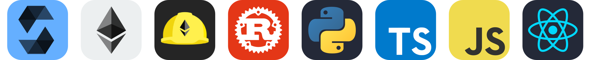

## 👋 Hi there, It's Arian!

 

As an ambitious Blockchain and Software Developer with a robust foundation in Computer Science and Software Engineering, I am driven by a passion for innovation and a commitment to continuous self-improvement. My career is distinguished by my efforts to push technological boundaries and explore new horizons in software development. I am dedicated to contributing to the open-source community, recognizing that collaboration can lead to significant progress and advancements. With proficiency in smart contract development using Solidity and strong skills in TypeScript, JavaScript, and various related technologies and frameworks, my expertise extends to a deep understanding of ERC standards and blockchain DApps development. My enthusiasm for GNU/Linux further complements my technical skills, allowing me to create impactful solutions and drive positive change within the digital landscape.

<strong> 🔭 My Professional skills </strong>

    

 

<strong> 🛠 My Favorite Tech / Tools </strong>

    

 

### NPM Packages 

<a href="https://npmjs.com/package/hardhat-jest" target="_blank">
    <ul><li><b>hardhat-jest</b>: A Hardhat plugin that allows you to use Jest easily!</li></ul>
</a>

 

### Arch Linux Packages 

<a href="https://aur.archlinux.org/packages/plank-theme-arian-git" target="_blank">
    <ul><li><b>plank-theme-arian</b>: Arian Theme for Plank dock!</li></ul>
</a>

 

### 🏆 Awards 💪🏻

    
 
 

<h3> GitHub Stats</h3>

<h3> 🤝 Where to find me </h3>

  

